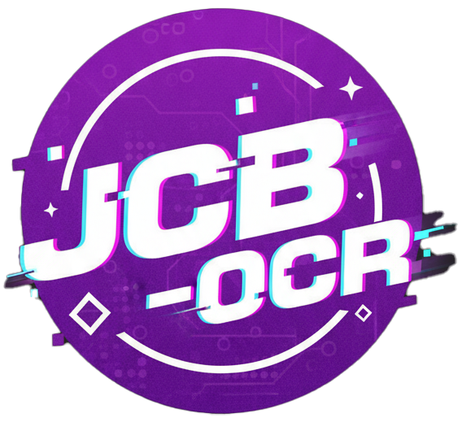
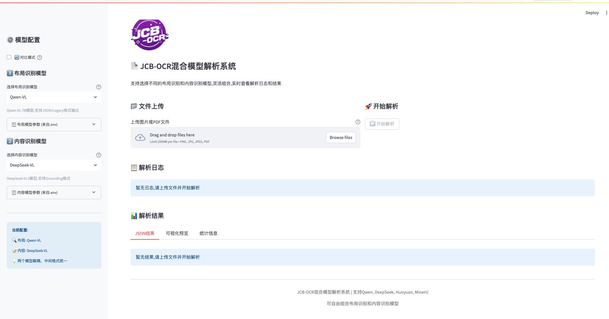
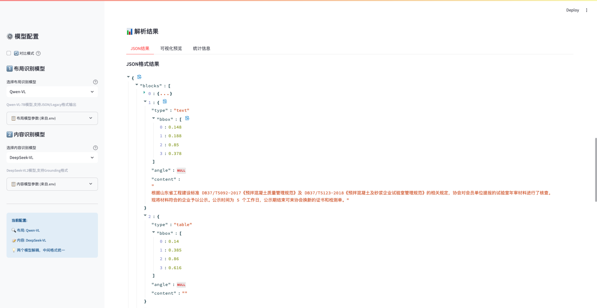
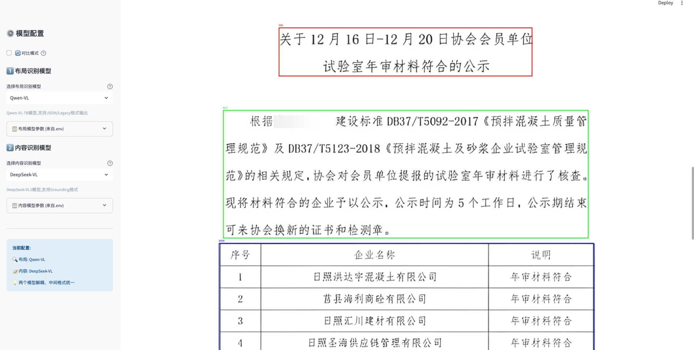
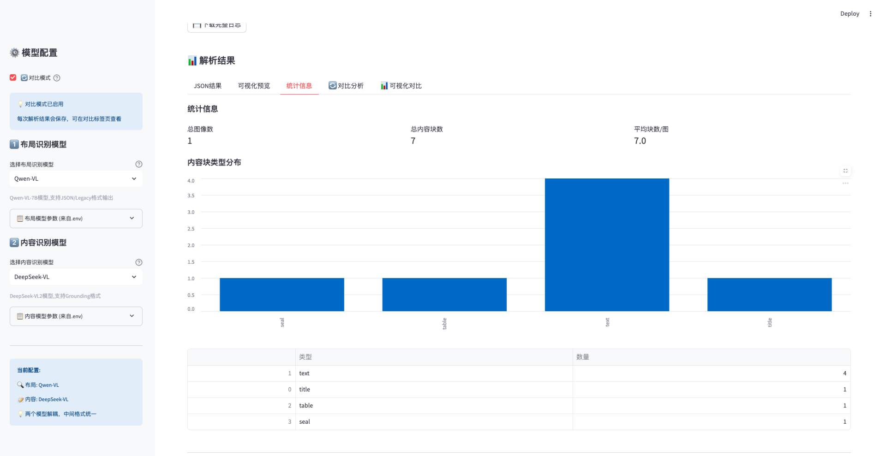
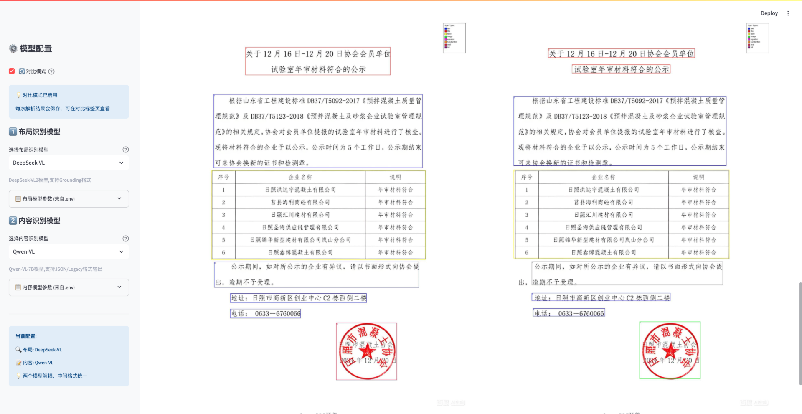

<div align="center">
  
</div>

# JCB-OCR 混合模型解析系统

JCB-OCR 是一个面向文档理解的交互式平台，支持在同一工作流中混合不同的布局识别模型与内容识别模型。系统基于 Streamlit 构建，配套的 `local_vl_utils` 模块提供多家 VLM 服务的统一客户端、提示模板与后处理组件，便于在本地或远程环境中快速完成文档解析任务。

## 项目背景
- **多模型融合的现实需求**：单一 OCR 模型难以同时完成复杂布局、表格/公式和高精度内容识别，本项目提供一套灵活的架构，将不同能力的模型通过统一接口组合起来，形成可拓展的协同方案。
- **便捷的验证与对比体验**：内置交互式测试与对比面板，可在同一数据集上快速切换配置、查看日志并保存多轮结果，显著缩短业务验证周期。
- **标准化输出格式**：内建的格式转换工具能把多种模型输出统一到标准 JSON 中，并支持可视化/下载，方便直接集成到现有业务系统。

## 主要特性
- **多模型解耦**：Qwen-VL、DeepSeek-VL、Hunyuan-VL、MinerU 等模型可任意组合，实现“布局检测 + 内容提取”解耦。
- **统一格式输出**：内置 `format_converter` 与多种后处理工具，可将不同模型的结果转换为统一的 JSON/标准结构。
- **可视化与对比**：在 Streamlit 中实时查看日志、JSON 结果、可视化标注，并支持对比不同模型组合的输出。
- **批量与异步请求**：`local_vl_utils` 封装了 HTTP 客户端、vLLM 引擎、异步批处理等能力，便于扩展到大规模任务。
- **日志留存与溯源**：API 调用、步骤日志可在 UI 内导出，便于排障与审计。

## 功能介绍
- **交互式解析工作台**：通过 Streamlit 页面上传图片/PDF，即时选择不同模型组合并查看实时日志，支持一键导出 JSON、日志及可视化结果。
- **识别统计面板**：自动汇总各类型内容块数量、平均块数、类型分布等指标，并提供图表展示，便于跟踪模型表现与业务覆盖情况。
- **对比实验模式**：开启“对比模式”即可记录多轮解析输出，提供统计、表格以及 Spans PDF 预览，帮助快速筛选最佳模型组合。
- **统一格式转换**：`format_converter` 将各模型返回的布局与内容数据对齐到统一标准，后端系统可以直接消费 `blocks + metadata` 结构。
- **可插拔客户端体系**：`client_factory` 支持注册自定义模型，通过 `.env` 或代码参数配置 server_url/API key 等信息，方便扩展。
- **完善的后处理链路**：涵盖表格重建、方程修复、手写类型区分等多种后处理工具，可根据业务需要组合使用。
- **API/日志监控**：HTTP 客户端内置调用日志与异常追踪，所有调用可落盘记录，方便排查问题和进行性能分析。

## 目前支持的识别类型
- **文本类**：普通段落、标题、列表项目等，可精确输出文本与位置坐标。
- **表格结构**：支持检测表格、还原单元格合并关系，并输出标准化 JSON 或 HTML。
- **图像/印章**：能区分图片、印章/签章等区域，可用于后续裁剪与二次识别。
- **公式/方程**：内置多种 LaTeX 后处理器，处理 double-subscript、left-right 等常见错误。
- **手写体**：对手写签批、签名等区域提供单独类型，便于针对性处理。

上述类型均可在可视化界面中查看标注结果，或通过标准 JSON 结构直接集成到业务系统。


## 界面截图
<div align="center">
  
  <p>主面板：模型选择与文件上传</p>
</div>
<div align="center">
  
  <p>统一 JSON 结果与下载按钮</p>
</div>
<div align="center">
  
  <p>可视化预览</p>
</div>
<div align="center">
  
  <p>识别统计面板与类型分布</p>
</div>
<div align="center">
  
  <p>对比实验模式</p>
</div>


## 目录结构
```
.
├─ app/                  # Streamlit 交互应用
│  ├─ streamlit_app.py   # 主界面与交互逻辑
│  └─ requirements.txt   # 应用依赖
└─ local_vl_utils/       # 模型客户端与工具库
   ├─ base_client.py
   ├─ client_factory.py
   ├─ config_loader.py
   ├─ prompt_library.py
   ├─ vlm_client/        # HTTP/vLLM 客户端实现
   ├─ post_process/      # 各类后处理模块
   └─ examples/          # JSON 转换示例
```

## 环境准备
1. Python 3.10+（推荐使用虚拟环境）
2. 安装依赖：
   ```bash
   pip install -r app/requirements.txt
   ```
3. 在 `vlm_client/.env`（或根目录 `.env`）中按如下格式配置模型参数：
   ```env
   QWEN_MODEL_NAME=Qwen2-VL-72B-Instruct
   QWEN_SERVER_URL=https://api.example.com
   QWEN_API_KEY=sk-xxx
   DEFAULT_TIMEOUT=600
   DEFAULT_MAX_RETRIES=3
   ```
   其他模型（DEEPSEEK/HUNYUAN/MINERU）同理，支持为每个模型设置独立的 `TIMEOUT`、`MAX_RETRIES` 等。

## 运行方式
1. 确认 `.env` 已配置完毕并可访问目标模型服务。
2. 在项目根目录执行：
   ```bash
   streamlit run app/streamlit_app.py
   ```
3. 打开浏览器中的 Streamlit 页面后：
   - 在侧边栏选择布局模型与内容模型。
   - 上传图片或 PDF 文件，可启用“对比模式”保存多次解析结果。
   - 查看实时日志、JSON 输出、可视化标注与统计信息。
 - 需要生成 spans PDF 对比时，可在“可视化对比”标签页生成并下载标注 PDF。

## 自定义与扩展
- 客户端注册：通过 `local_vl_utils.client_factory.register_custom_client` 注册自定义模型，实现统一的创建与配置流程。
- 批处理/异步：使用 `BaseOCRClient.aio_batch_predict` 等方法可在后端脚本中批量拉取结果。
- 后处理链：`local_vl_utils/post_process` 下提供常见结构化处理能力，可按需修改或接入新的处理器。
- 日志：API 调用日志默认写入 `logs/api_calls/`，Streamlit 中也提供完整日志下载按钮。


## 贡献指南
欢迎加入 JCB-OCR 社区！提交修改前请注意：
1. **遵循风格**：统一使用 `loguru` 记录日志，不提交临时代码或敏感配置；如新增模块请补充必要注释。
2. **分支与提交**：每个功能或修复请单独建分支，`commit` 信息需清晰描述改动内容，例如 `fix: normalize mineru output`.
3. **验证流程**：拉取请求前请至少跑通一次 `streamlit run app/streamlit_app.py` 或提供等效验证说明。
4. **依赖同步**：新增依赖时更新对应的 `requirements`，并确认不会破坏现有运行环境。

建议先在 Issues 中讨论新想法，也可以直接发起 PR，欢迎更多同学一起共建高质量的文档解析框架。

## 许可证与署名要求
本项目采用自定义的 **JCB-OCR Attribution License 1.0**（见 `LICENSE`）。任何使用、修改或分发本项目及其衍生作品的行为，都必须保留版权声明，并在显著位置标注“Derived from JCB-OCR”或类似署名说明，附带项目链接。

如需商业合作或额外授权，请联系仓库维护者。
